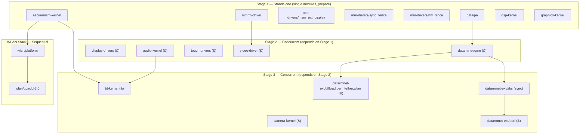
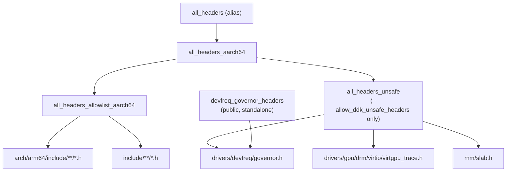

#  Build System Reference

> **Platform**: Blair SoC (SM6375) · **Board ID**: P86803AA1 · **Kernel**: Linux 6.1.128 GKI
> **Build system**: Bazel / Kleaf (DDK) 

---

## Table Of Contents

1. [Architecture Overview](#1-architecture-overview)
2. [Phase 1: Kernel Build (`build.sh`)](#2-phase-1-kernel-build)
3. [Phase 2: External DDK Modules (`build-ddk.sh`)](#3-phase-2-external-ddk-modules)
4. [Phase 3: AOSP (`mka bacon`)](#4-phase-3-aosp-integration)
5. [Bazel Target System](#5-bazel-target-system)
6. [ddk_headers Visibility Rules](#6-ddk_headers-visibility-rules)
7. [Module Dependency Graph & Symbol Handoff](#7-module-dependency-graph--symbol-handoff)
8. [Staging Pipeline `prepare_vendor.sh`](#8-staging-pipeline)
9. [AOSP Module Wiring `kernel-platform-board.mk`](#9-aosp-module-wiring)
10. [QC Defs Inheritance System](#10-qc-defs-aggregation)
11. [Environment Variables Reference](#11-environment-variables-reference)
12. [Common Failure Modes & Fixes](#12-common-failure-modes)
13. [Adding a New External Module](#13-adding-a-new-external-module)
14. [CodeLinaro Reference Platform](#14-codelinaro-reference)
15. [File Cross-Reference Index](#15-file-cross-reference)

---

## 1. Architecture Overview

The build is a **three phase pipeline**. Each phase has a distinct trigger, specific tools, and even more specific output directories.

```
  Phase 1                    Phase 2                       Phase 3
  ───────                    ───────                       ───────
  ./build.sh                 config/build-ddk.sh           mka bacon
       │                          │                             │
       ▼                          ▼                             ▼
  prepare_vendor.sh          build_module.sh ×N            Android Make
       │                     (Bazel DDK per module)        Build_external_kernelmodule.mk
       ▼                          │                             │
  build_with_bazel.py             ▼                             ▼
  //msm-kernel:P86803AA1_gki  *.ko → DLKM_OBJ/            BOARD_VENDOR_KERNEL_MODULES
       │                          │                        BOARD_GKI_KERNEL_MODULES
       ▼                          ▼                             │
  device/qcom/blair-kernel/   Module.symvers chains             ▼
  ├─ Image, .config, vmlinux                              boot.img
  ├─ system_dlkm/  vendor_dlkm/                           vendor_dlkm.img
  ├─ kp-dtbs/                                             system_dlkm.img
  └─ kernel-headers/
```

> [!IMPORTANT]
> **`kernel_platform/` is NOT just source** — it is the **build engine** for Phase 2 and Phase 3. It contains Bazel, Kleaf rules, and toolchain wrappers. Do not delete it after Phase 1

---

## 2. Phase 1: Kernel Build

**Entry point**: [build.sh](https://github.com/Samsung-QTI-Blair/android_kernel_platform_build_config/blob/P86803AA1/build.sh)

### What [build.sh](https://github.com/Samsung-QTI-Blair/android_kernel_platform_build_config/blob/P86803AA1/build.sh) Does

1. Sets device identity:
   ```bash
   MODEL=gta9pwifi  CHIPSET_NAME=P86803AA1  TARGET_BOARD_PLATFORM=blair
   MSM_ARCH=P86803AA1  TARGET_BUILD_VARIANT=user  TARGET_PRODUCT=gki
   ```
2. Creates output directories:
   - `OUT_DIR=out/msm-kernel-P86803AA1-gki`
   - `ANDROID_PRODUCT_OUT=out/target/product/gta9pwifi`
3. Exports `KBUILD_EXT_MODULES` and `KBUILD_EXTRA_SYMBOLS` (used by Phase 2 if invoked from [prepare_vendor.sh](https://github.com/Samsung-QTI/android_kernel_build/blob/kernel.lnx.6.1.r46-rel/android/prepare_vendor.sh))
4. Sets `RECOMPILE_KERNEL=1` and calls:
   ```bash
   kernel_platform/build/android/prepare_vendor.sh  P86803AA1  gki
   ```

### Inside [prepare_vendor.sh](https://github.com/Samsung-QTI/android_kernel_build/blob/kernel.lnx.6.1.r46-rel/android/prepare_vendor.sh)

Source: [prepare_vendor.sh](https://github.com/Samsung-QTI/android_kernel_build/blob/kernel.lnx.6.1.r46-rel/android/prepare_vendor.sh) 

**Step-by-step**:

| Lines | Action |
|---|---|
| 130–147 | Resolves `ANDROID_KERNEL_OUT` → `device/qcom/blair-kernel/` |
| 150–165 | Maps `user` → `gki`, everything else → `consolidate` |
| 167–180 | Target aliasing: `taro→waipio`, `volcano→pineapple`, `anorak61→anorak` |
| 191–196 | Runs `build/brunch P86803AA1 gki` to create a temp build config |
| 259–269 | **Compiles kernel**: `build_with_bazel.py -t P86803AA1 gki --skip abl` |
| 275–317 | ABL section — **commented out** (no ABL build) |
| 319–462 | **Staging**: copies artifacts to `device/qcom/blair-kernel/` — see [§8](#8-staging-pipeline) |
| 504–506 | Cleans Android.mk/Android.bp from kernel_platform tree |
| 519–530 | Exports UAPI headers via `export_headers.py` |
| 535–548 | Runs `build_module.sh` with empty `EXT_MODULES` (modules_prepare only) |
| 554–572 | Compiles vendor devicetree overlays via `build_module.sh dtbs` |
| 574–589 | Merges DTBs via `merge_dtbs.sh` |
| 593 | `rm -rf kernel_platform/out/bazel` prevents stale Bazel cache |

### Bazel Invocation

`build_with_bazel.py` initiates with:
```
//msm-kernel:P86803AA1_gki_dist
```

This triggers the cascade:
```
define_msm_la("P86803AA1", "gki", in_tree_module_list + sec_bsp(...))
  → _define_build_config()     → kernel_build_config (concatenates 8 build.config files)
  → _define_kernel_build()     → kernel_build + kernel_modules_install
  → _define_image_build()      → kernel_images (vendor_dlkm, system_dlkm, boot/dtbo)
  → _define_kernel_dist()      → copy_to_dist_dir → out/.../dist/
```

---

## 3. Phase 2: External DDK Modules

**Entry point**: [config/build-ddk.sh](file:///home/shrek/android/kernel_platform/config/build-ddk.sh) 

This script builds **all external BSP kernel modules** using the Bazel DDK. It runs from `TOP` and uses `build_module.sh` as the build engine

### Environment Setup

```bash
export TARGET_BOARD_PLATFORM=blair    # btgt resolves to "blair"
export VARIANT=gki
export KERNEL_KIT=~/android/device/qcom/blair-kernel
export OUT_DIR=~/android/out/target/product/gta9pwifi/obj/DLKM_OBJ/kernel_platform
export ENABLE_DDK_BUILD=true
```

> [!NOTE]
> Unset `CHIPSET_NAME=P86803AA1`, the target is only used for the initial kernel build. DDK modules query for `blair_gki_*_dist` targets.

### Staged Build Order

The modules are built in **three stages** with **dependency aware parallelism**:



### Symbol Dependency Chains (KBUILD_EXTRA_SYMBOLS)

| Consumer | Producer(s) |
|---|---|
| video-driver | mmrm-driver |
| datarmnet/core | dataipa |
| bt-kernel | audio-kernel, securemsm-kernel |
| datarmnet-ext/* | datarmnet/core |
| datarmnet-ext/perf | datarmnet/core, datarmnet-ext/shs |
| wlan/platform | securemsm-kernel |
| wlan/qcacld-3.0 | wlan/platform |

---

## 4. Phase 3: AOSP Integration

**Entry point**: `source build/envsetup.sh && lunch lineage_gta9pwifi-ap2a-userdebug && mka bacon`

### Step A: Configuration Aggregation

1. [BoardConfig.mk](file:///home/shrek/android/device/samsung/gta9pwifi/BoardConfig.mk) loads:
   - `TARGET_BOARD_PLATFORM := blair`
   - `CHIPSET_NAME := P86803AA1`
   - `-include vendor/qcom/defs/board-defs/system/*.mk`
   - `-include vendor/qcom/defs/board-defs/vendor/*.mk`

2. `device.mk` loads QC product defs and `kernel-platform-product.mk`

### Step B: DLKM Module Build (Make→Bazel Bridge)

When AOSP encounters a `PRODUCT_PACKAGES += audio_dlkm`:

```
Android.mk → include Build_external_kernelmodule.mk
  → MODULE_KP_COMBINED_TARGET recipe:
      cd kernel_platform && ./build/build_module.sh
      with KERNEL_KIT, EXT_MODULES, CHIPSET_NAME, OUT_DIR
```

See [Build_external_kernelmodule.mk](https://git.codelinaro.org/clo/la/device/qcom/common/-/blob/qcom-devices.lnx.16.0.r8-rel/dlkm/Build_external_kernelmodule.mk)

### Step C: Bazel Output (Artifacts)

| Image | Source |
|---|---|
| `boot.img` | `device/qcom/blair-kernel/Image` + ramdisk |
| `vendor_dlkm.img` | In-tree vendor KOs + DDK-built BSP KOs |
| `system_dlkm.img` | GKI protected modules from `system_dlkm/` |

---

## 5. Bazel Target System

### Target Name Formula

Generated by [msm_kernel_la.bzl:L466](https://github.com/Samsung-QTI-Blair/kernel-qcom/blob/lineage-23.0/msm_kernel_la.bzl#L466):
```python
target = msm_target.replace("_", "-") + "_" + variant.replace("_", "-")
```

### Key Targets

| Target | Purpose | Generated By |
|---|---|---|
| `//msm-kernel:P86803AA1_gki` | Main kernel_build (Image + ~263 in-tree .ko's) | `define_msm_la()` |
| `//msm-kernel:P86803AA1_gki_dist` | copy_to_dist_dir → `out/.../dist/` | `_define_kernel_dist()` |
| `//msm-kernel:P86803AA1_gki_images` | kernel_images (boot, vendor_dlkm, system_dlkm) | `_define_image_build()` |
| `//msm-kernel:blair_gki` | Generic blair kernel_build (~241 modules) | `define_msm_la()` |
| `//msm-kernel:blair_gki_dist` | Generic blair dist | `_define_kernel_dist()` |

### External Module Dist Targets

Discovered by `build_module.sh` via Bazel query:
```bash
filter_regex="${btgt/_/-}_${VARIANT/_/-}_${SUBTARGET_REGEX:-.*}_dist$"
build_target=$(./tools/bazel query "filter('${filter_regex}', //${pkg_path}/...)")
```

### btgt Resolution Table

Source: [build_module.sh:L291-306](https://github.com/Samsung-QTI/android_kernel_build/blob/kernel.lnx.6.1.r46-rel/build_module.sh#L291-L306)

| `TARGET_BOARD_PLATFORM` | Resolved `btgt` |
|---|---|
| `blair` | `blair` |
| `msmnile` | `gen3auto` |
| `sm6150` | `sdmsteppeauto` |
| `volcano` | `pineapple` |
| `anorak61` | `anorak` |
| `neo61` | `neo-la` |
| `mdm9607` | `mdm9607` (+ variant dash replacement) |
| *all others* | same as `TARGET_BOARD_PLATFORM` |

---

## 6. ddk_headers Visibility Rules

Source: [msm-kernel/BUILD.bazel](https://github.com/Samsung-QTI-Blair/kernel-qcom/blob/lineage-23.0/BUILD.bazel)



| Target | Visibility | Use Case |
|---|---|---|
| `//msm-kernel:all_headers` | **public** | Default for all DDK modules |
| `//msm-kernel:all_headers_unsafe` | **private** | Internal kernel headers — requires flag |
| `//msm-kernel:devfreq_governor_headers` | **public** | GPU/devfreq modules needing `governor.h` |

### Per-Module Header Exports

External modules declare their own `ddk_headers`:
```python
# audio-kernel/BUILD.bazel
ddk_headers(name = "audio_headers",
    hdrs = [":audio_common_headers", ":audio_uapi_headers", ...])
```

---

## 7. Module Dependency Graph & Symbol Handoff

### In-Tree Module Counts

| Platform Target | Module Count | Extras vs. Blair |
|---|---|---|
| `blair_gki` | ~241 | Base QC reference set |
| `P86803AA1_gki` | ~263 | +Samsung: tcpc, wt_charger, guardianm, hid-pogopin, usb_notifier_qcom, battery_auth, etc. |

### Samsung BSP Modules

Source: [sec_bsp.bzl](https://github.com/Samsung-QTI-Blair/kernel-qcom/blob/lineage-23.0/sec_bsp.bzl) (72 lines)

`P86801AA1` defines the base list (~40 modules). All Samsung chipset variants share it via `initialize_module_platform_map()`:
```python
targets_to_add = ["P86801GA1", "P86801EA1", "P86803AA1", "P86802AA1", ...]
for key in targets_to_add:
    __module_platform_map[key] = __module_platform_map["P86801AA1"]
```

### Module.symvers Concatenation

After each DDK module builds ([build_module.sh:L350-352](https://github.com/Samsung-QTI/android_kernel_build/blob/kernel.lnx.6.1.r46-rel/build_module.sh#L350-L352)):
```bash
cat "${OUT_DIR}/${EXT_MOD_REL}/${btgt}_${VARIANT}"_*_Module.symvers \
    > "${OUT_DIR}/${EXT_MOD_REL}/Module.symvers"
```
This merged `Module.symvers` is available for subsequent modules.

---

## 8. Staging Pipeline

Source: [prepare_vendor.sh:L319-462](https://github.com/Samsung-QTI/android_kernel_build/blob/kernel.lnx.6.1.r46-rel/android/prepare_vendor.sh#L319-L462)

### Artifacts Copied to `device/qcom/blair-kernel/`

| Artifact | Source | Destination |
|---|---|---|
| Image, vmlinux, System.map | `dist/` | root |
| .config, Module.symvers, build_opts.txt | `dist/` | root |
| kernel-uapi-headers.tar.gz | `dist/` | root → extracted to `kernel-headers/` |
| *.ko (first stage) | files listed in `dist/modules.load` | root |
| *.ko (system_dlkm) | `system_dlkm_staging_archive.tar.gz` | `system_dlkm/` |
| *.ko (vendor_dlkm) | remaining .ko NOT in first-stage or system_dlkm | `vendor_dlkm/` |
| DTBs/DTBOs/images | `dist/*.dtb*`, `dist/dtb.img`, `dist/dtbo.img` | `kp-dtbs/` |
| Host tools | `host/` | `host/` |
| Debug artifacts | `dist/<target>_<variant>_debug.tar.gz` | `debug/` |
| Blocklists/load orders | `dist/modules.blocklist`, `dist/vendor_dlkm.modules.*` | respective dirs |

### Categorization

```
first_stage_kos   = basenames from dist/modules.load → found in dist/
system_dlkm_kos   = basenames from system_dlkm.modules.load MINUS unprotected list
vendor_dlkm_kos   = all *.ko NOT in first_stage AND NOT in system_dlkm
```

---

## 9. AOSP Module Wiring

Source: [kernel-platform-board.mk](https://github.com/Samsung-QTI-Blair/vendor_qcom_opensource_kernel-scripts/blob/lineage-23.0/kernel-platform/kernel-platform-board.mk)  

### `get-kernel-modules` Function

```makefile
define get-kernel-modules
$(if $(wildcard $(KERNEL_PREBUILT_DIR)/$(1)/modules.load),
    $(addprefix $(KERNEL_PREBUILT_DIR)/$(1)/,$(notdir $(file < .../modules.load))),
    $(wildcard $(KERNEL_PREBUILT_DIR)/$(1)/*.ko))
endef
```

### Module → Partition Mapping

```makefile
first_stage_modules  := $(call get-kernel-modules,.)
gki_modules          := $(call get-kernel-modules,system_dlkm)
second_stage_modules := $(call get-kernel-modules,vendor_dlkm)

BOARD_VENDOR_RAMDISK_KERNEL_MODULES += $(first_stage_modules) $(gki_modules) $(second_stage_modules)
BOARD_GKI_KERNEL_MODULES            += $(gki_modules)
BOARD_VENDOR_KERNEL_MODULES         += $(second_stage_modules)
```

### Recovery Filtering

`cfg80211.ko` and `mac80211.ko` are filtered from recovery (depend on `rfkill` — a GKI module not loadable in recovery boot).

---

## 10. QC Defs Aggregation

`vendor/qcom/defs` is a **virtual aggregation point** populated by repo `linkfile` entries.

### How It Works

1. Each BSP repo has config makefiles (e.g., `audio_kernel_vendor_board.mk`)
2. Manifest `linkfile` entries symlink them into `vendor/qcom/defs/board-defs/vendor/`
3. [BoardConfig.mk]() includes via wildcards:
   ```makefile
   -include $(sort $(wildcard vendor/qcom/defs/board-defs/system/*.mk))
   -include $(sort $(wildcard vendor/qcom/defs/board-defs/vendor/*.mk))
   ```

> [!CAUTION]
> **If `vendor/qcom/defs` is empty, BSP modules will NOT be built.** The build will silently exclude all audio, display, WLAN, and touch drivers.

---

## 11. Environment Variables Reference

| Variable | Set By | Consumed By | Value for gta9pwifi |
|---|---|---|---|
| `CHIPSET_NAME` | `build.sh` / `BoardConfig.mk` | `Build_external_kernelmodule.mk`, `build_module.sh` | `P86803AA1` (Phase 1) · `blair` (Phase 2 DDK) |
| `TARGET_BOARD_PLATFORM` | `BoardConfig.mk` | `build_module.sh`, `kernel-platform-board.mk` | `blair` |
| `TARGET_BUILD_VARIANT` | `build.sh` / `lunch` | `prepare_vendor.sh` → variant mapping | `user`→`gki` / `userdebug`→`consolidate` |
| `KERNEL_TARGET` | arg to `prepare_vendor.sh` | `build_with_bazel.py` | `P86803AA1` |
| `KERNEL_VARIANT` | arg / env | `prepare_vendor.sh` | `gki` |
| `KERNEL_KIT` | computed / env | `build_module.sh` | `device/qcom/blair-kernel` |
| `OUT_DIR` | env | `build_module.sh` | `.../DLKM_OBJ/kernel_platform` |
| `EXT_MODULES` | env | `build_module.sh` loop | space-separated vendor paths |
| `ENABLE_DDK_BUILD` | `build-ddk.sh` / `_setup_env.sh` | `build_module.sh` DDK gate | `true` |
| `VARIANT` | `_setup_env.sh` / `build-ddk.sh` | `build_module.sh` filter_regex | `gki` |
| `ALLOW_UNSAFE_DDK_HEADERS` | env | `build_module.sh` | `false` (add `--allow_ddk_unsafe_headers`) |
| `KBUILD_EXTRA_SYMBOLS` | env / `build-ddk.sh` | Kbuild modpost | Space-separated `Module.symvers` paths |
| `KERNEL_PREBUILT_DIR` | `kernel-platform-board.mk` | AOSP build system | `device/qcom/blair-kernel` |
| `RECOMPILE_KERNEL` | computed / env | `prepare_vendor.sh` | `1` when Image missing or build.config changed |
| `MSM_ARCH` | `build.sh` | `build.config.msm.gki.sec` | `P86803AA1` |

---

## 12. Common Failure Modes

### 12.1 `governor.h` Not Found

**Symptom**: `fatal error: governor.h: No such file or directory`  
**Fix**: Add `//msm-kernel:devfreq_governor_headers` to `deps` in `ddk_module()`.

### 12.2 Missing BUILD.bazel

**Symptom**: `error - no Bazel package associated with <module_path>`  
**Cause**: `build_module.sh` walks up from module path looking for `BUILD.bazel`. Hits WORKSPACE.  
**Fix**: Ensure every module root has a `BUILD.bazel`.

### 12.3 btgt / Filter Regex Mismatch

**Symptom**: `bazel query` returns no matching targets  
**Cause**: `TARGET_BOARD_PLATFORM` doesn't match btgt aliases, or .bzl didn't register the platform.  
**Fix**: Check btgt mapping in [build_module.sh:L291-306](file:///home/shrek/android/kernel_platform/build/build_module.sh#L291-L306).

### 12.4 Multiple Dist Targets Found

**Symptom**: `error - multiple targets found matching "<regex>"`  
**Fix**: Use `SUBTARGET_REGEX` env var to narrow the match, or ensure only one `_dist` target per package.

### 12.5 Undefined Symbol (modpost)

**Symptom**: `WARNING: modpost: "<symbol>" undefined!`  
**Cause**: Build order wrong or `KBUILD_EXTRA_SYMBOLS` missing producer's `Module.symvers`.  
**Fix**: Order `EXT_MODULES` so dependencies build first. See Stage ordering in [§3](#3-phase-2-external-ddk-modules).

### 12.6 Stale Bazel Cache

**Symptom**: Build uses stale cached outputs  
**Fix**: `rm -rf kernel_platform/out/bazel` (done automatically by `prepare_vendor.sh:L593`).

### 12.7 `gki_system_dlkm_modules` AWK Error

**Symptom**: `awk: can't open file ...gki_system_dlkm_modules`  
**Fix**: Non-critical — resolves on clean rebuild. The file is a Bazel `write_file` target.

### 12.8 ABL Build Failure

**Symptom**: Errors referencing `bootable/bootloader/edk2`  
**Fix**: Already handled — `prepare_vendor.sh` passes `--skip abl` and ABL section is commented out.

### 12.9 CHIPSET_NAME vs TARGET_BOARD_PLATFORM Mismatch

**Symptom**: External modules compile against `blair_gki` instead of `P86803AA1_gki`, missing Samsung USB symbols.  
**Cause**: Double source-of-truth between Make and Bazel.  
**Fix**: Applied — `Build_external_kernelmodule.mk` now passes `CHIPSET_NAME` to `build_module.sh`. See [build_flow_analysis.md](file:///home/shrek/android/build_flow_analysis.md).

---

## 13. Adding a New External Module

### Prerequisites

- Module source exists under `vendor/qcom/opensource/<module>/`
- Manifest `linkfile` maps it into `kernel_platform/vendor/qcom/opensource/<module>/`

### Step 1: Create BUILD.bazel

```python
load("//build/kernel/kleaf:kernel.bzl", "ddk_headers", "ddk_module")
load("//build/bazel_common_rules/dist:dist.bzl", "copy_to_dist_dir")
package(default_visibility = ["//visibility:public"])

load(":build/<module>_defs.bzl", "define_<module>_target")
define_<module>_target()
```

### Step 2: Create .bzl Definition

```python
def define_target_variant_module(target, variant):
    tv = "{}_{}".format(target, variant)
    ddk_module(
        name = "{}_<name>".format(tv),
        out = "<name>.ko",
        srcs = native.glob(["**/*.c", "**/*.h"]),
        kernel_build = "//msm-kernel:{}".format(tv),
        deps = ["//msm-kernel:all_headers"],
    )
    copy_to_dist_dir(
        name = "{}_<name>_dist".format(tv),
        data = ["{}_<name>".format(tv)],
        ...)

def define_<module>_target():
    for variant in ["gki", "consolidate"]:
        define_target_variant_module("blair", variant)
```

### Step 3: Add to Build Pipeline

**Option A** — Add to [config/build-ddk.sh](https://github.com/Samsung-QTI-Blair/android_kernel_platform_build_config/blob/P86803AA1/build-ddk.sh) in the appropriate stage.

**Option B** — Add `PRODUCT_PACKAGES += <module>` to `device.mk` + `Android.mk` with `include $(BUILD_DLKM)`.

### Step 4: Verify

```bash
cd kernel_platform
./tools/bazel query "filter('blair_gki_.*_dist$', //vendor/qcom/opensource/<module>/...)"
```

---

## 14. CodeLinaro Reference

CodeLinaro (`git.codelinaro.org/clo/la`) is Qualcomm's public mirror. Useful as a **reference** for build system wiring, not as a content reference for Samsung specific modules

| CLO Repo | Branch | Extract |
|---|---|---|
| `device/qcom/common` | `qcom-devices.lnx.16.0.r8-rel` | `Build_external_kernelmodule.mk`, `kernel-platform-board.mk` |
| `device/qcom/blair` | `qcom-devices.lnx.15.0.r1-rel` | Reference `BoardConfig.mk`, module lists |

> [!WARNING]
> **CLO blair ≠ Blair-SEC.** Samsung adds USB gadget drivers, display panel drivers, and `CHIPSET_NAME=P86803AA1` that do not exist in CLO reference

### Tag Hierarchy

```
LA.QSSI.16.0.r1-10900       ← System image (framework)
LA.VENDOR.14.3.1.r1-04500   ← Vendor image (HALs)    
KERNEL.PLATFORM.3.0.r19     ← Kernel platform (Kleaf)
```

---

## 15. File Cross-Reference

| File | Purpose | Sections |
|---|---|---|
| [build.sh](file:///home/shrek/android/build.sh) | Phase 1 entry point | §2 |
| [prepare_vendor.sh](file:///home/shrek/android/kernel_platform/build/android/prepare_vendor.sh) | Kernel build + staging | §2, §8 |
| [build-ddk.sh](file:///home/shrek/android/kernel_platform/config/build-ddk.sh) | Phase 2 staged DDK build | §3 |
| [build_module.sh](file:///home/shrek/android/kernel_platform/build/build_module.sh) | DDK module builder | §3, §5, §7 |
| [msm_kernel_la.bzl](file:///home/shrek/android/kernel_platform/msm-kernel/msm_kernel_la.bzl) | `define_msm_la()` macro | §5 |
| [blair.bzl](file:///home/shrek/android/kernel_platform/msm-kernel/blair.bzl) | Blair in-tree module list | §7 |
| [P86803AA1.bzl](file:///home/shrek/android/kernel_platform/msm-kernel/P86803AA1.bzl) | Samsung device module list | §7 |
| [sec_bsp.bzl](file:///home/shrek/android/kernel_platform/msm-kernel/sec_bsp.bzl) | Samsung BSP modules | §7 |
| [BUILD.bazel](file:///home/shrek/android/kernel_platform/msm-kernel/BUILD.bazel) | Kernel targets + ddk_headers | §5, §6 |
| [kernel-platform-board.mk](file:///home/shrek/android/vendor/qcom/opensource/kernel-scripts/kernel-platform/kernel-platform-board.mk) | AOSP module wiring | §9 |
| [Build_external_kernelmodule.mk](file:///home/shrek/android/device/qcom/common/dlkm/Build_external_kernelmodule.mk) | Make→Bazel bridge | §4 |
| [BoardConfig.mk](file:///home/shrek/android/device/samsung/gta9pwifi/BoardConfig.mk) | Device board config | §4, §10 |
| [build_flow_analysis.md](file:///home/shrek/android/build_flow_analysis.md) | CHIPSET_NAME fix record | §12.9 |
