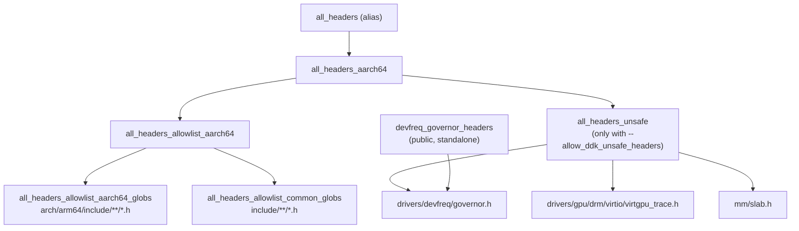
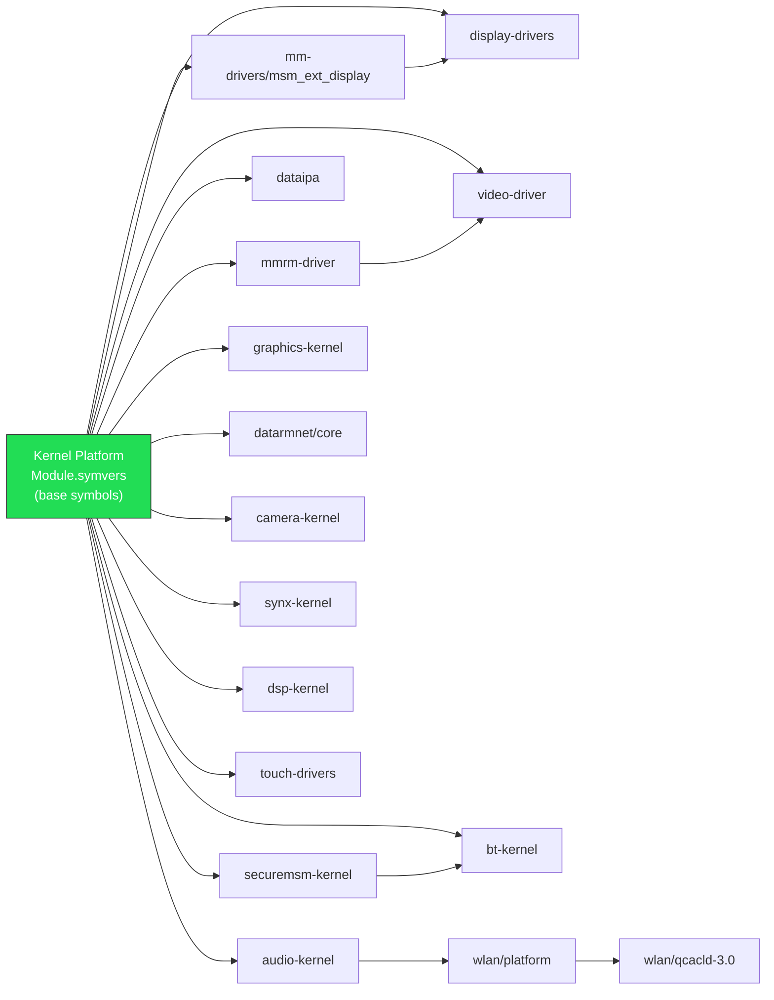

# Qualcomm DDK / Kleaf Kernel Build Flow — Blair (gta9pwifi)

> **Scope**: Samsung gta9pwifi — Blair SoC (SM6375), board ID P86803AA1
> **Build system**: Bazel / Kleaf (no legacy Make kernel path)

---

## 1. Overview Diagram

```
  ┌─────────────────────────────────────────────────────────────────────┐
  │                    prepare_vendor.sh                               │
  │  (lunch env → KERNEL_TARGET=blair → KERNEL_VARIANT=gki)           │
  │                         │                                          │
  │                         ▼                                          │
  │              build_with_bazel.py --skip abl                        │
  │              -t blair gki --out_dir <OUT>                          │
  │                         │                                          │
  │                         ▼                                          │
  │           Bazel/Kleaf:  //msm-kernel:blair_gki_dist                │
  │                         │                                          │
  │              ┌──────────┴──────────┐                               │
  │              ▼                     ▼                                │
  │     <OUT>/dist/Image         <OUT>/dist/*.ko                       │
  │     <OUT>/dist/Module.symvers   <OUT>/dist/*.dtb*                  │
  │     <OUT>/dist/.config          <OUT>/dist/build_opts.txt          │
  └──────────────────────────────────────────────────────────────────────┘
                              │
          copy / stage  ──────┘
                              ▼
  ┌───────────────────────────────────────────────────────────────┐
  │   device/qcom/blair-kernel/                                   │
  │   ├── Image, vmlinux, System.map, .config, Module.symvers     │
  │   ├── build_opts.txt, kernel-uapi-headers.tar.gz              │
  │   ├── kernel-headers/   (processed UAPI)                      │
  │   ├── kp-dtbs/          (dtb, dtbo, dtb.img, dtbo.img)        │
  │   ├── system_dlkm/      (GKI protected modules)               │
  │   ├── vendor_dlkm/      (vendor KOs + modules.load)           │
  │   ├── host/             (host tools: dtc, mkdtimg etc)        │
  │   └── *.ko              (first-stage modules)                 │
  └───────────────────────────────────────────────────────────────┘
                              │
   prepare_vendor.sh also runs build_module.sh for each *-devicetree
   project found under vendor/ :
                              │
                              ▼
  ┌───────────────────────────────────────────────────────────────────┐
  │   build_module.sh  (for each EXT_MODULES entry)                   │
  │   1. Symlinks top-level module dir into kernel_platform/          │
  │   2. Finds BUILD.bazel in module tree                             │
  │   3. Resolves btgt = TARGET_BOARD_PLATFORM (blair → blair)        │
  │   4. filter_regex = blair_gki_.*_dist$                            │
  │   5. bazel query  filter('...', //<pkg>/...)                      │
  │   6. bazel run --flags <target>_dist -- --dist_dir=<OUT>          │
  │   7. Concatenates Module.symvers fragments                        │
  └───────────────────────────────────────────────────────────────────┘
                              │
                              ▼
  ┌────────────────────────────────────────────────────────────────────┐
  │   out/target/product/gta9pwifi/obj/DLKM_OBJ/                      │
  │   └── vendor/qcom/opensource/<module>/                              │
  │       ├── *.ko                                                     │
  │       └── Module.symvers                                           │
  └────────────────────────────────────────────────────────────────────┘
                              │
  kernel-platform-board.mk   │
  reads KERNEL_PREBUILT_DIR   │
                              ▼
  ┌────────────────────────────────────────────────────────────────┐
  │   BOARD_VENDOR_KERNEL_MODULES → vendor_dlkm.img                │
  │   BOARD_GKI_KERNEL_MODULES   → system_dlkm.img                │
  │   BOARD_VENDOR_RAMDISK_KERNEL_MODULES → vendor ramdisk         │
  └────────────────────────────────────────────────────────────────┘
```

---

## 2. Environment Variables Reference

| Variable | Set By | Consumed By | Description |
|---|---|---|---|
| `ANDROID_BUILD_TOP` | `lunch` | [prepare_vendor.sh](file:///home/shrek/android/kernel_platform/build/android/prepare_vendor.sh), [build_module.sh](file:///home/shrek/android/kernel_platform/build/build_module.sh) | Android source tree root |
| `TARGET_PRODUCT` | `lunch` | [prepare_vendor.sh](file:///home/shrek/android/kernel_platform/build/android/prepare_vendor.sh) | Product name (e.g. `gta9pwifi`) |
| `TARGET_BOARD_PLATFORM` | device mk | [build_module.sh](file:///home/shrek/android/kernel_platform/build/build_module.sh), [kernel-platform-board.mk](file:///home/shrek/android/vendor/qcom/opensource/kernel-scripts/kernel-platform/kernel-platform-board.mk) | SoC platform (e.g. `blair`) |
| `TARGET_BUILD_VARIANT` | `lunch` | [prepare_vendor.sh](file:///home/shrek/android/kernel_platform/build/android/prepare_vendor.sh) | `user` → `gki`; `userdebug`/`eng` → `consolidate` |
| `KERNEL_TARGET` | arg / env | [prepare_vendor.sh](file:///home/shrek/android/kernel_platform/build/android/prepare_vendor.sh) | Bazel target SoC (default `$TARGET_PRODUCT`, aliased: `taro→waipio`, `volcano→pineapple`) |
| `KERNEL_VARIANT` | arg / env | [prepare_vendor.sh](file:///home/shrek/android/kernel_platform/build/android/prepare_vendor.sh) | `gki` or `consolidate` |
| `KERNEL_KIT` | [prepare_vendor.sh](file:///home/shrek/android/kernel_platform/build/android/prepare_vendor.sh) | [build_module.sh](file:///home/shrek/android/kernel_platform/build/build_module.sh) | Path to prebuilt artifacts (`device/qcom/blair-kernel`) |
| `ANDROID_KERNEL_OUT` | computed | `prepare_vendor.sh` | = `$ANDROID_BUILD_TOP/device/qcom/$TARGET_BOARD_PLATFORM-kernel` |
| `ANDROID_KP_OUT_DIR` | computed | `prepare_vendor.sh` | Bazel output dir (default `out/msm-kernel-blair-gki`) |
| `OUT_DIR` | env | `build_module.sh` | Module build output dir |
| `EXT_MODULES` | env | `build_module.sh` | Space-separated list of external module paths |
| `ENABLE_DDK_BUILD` | `_setup_env.sh` | `build_module.sh` | When `true`, use Bazel DDK path (not legacy make) |
| `VARIANT` | `_setup_env.sh` | `build_module.sh` | `gki` or `consolidate` (feed into `filter_regex`) |
| `RECOMPILE_KERNEL` | computed | `prepare_vendor.sh` | `1` when dist/Image missing or build.config changed |
| `LTO` | env | `prepare_vendor.sh` | LTO optimization level (`thin`, `full`, `none`) |
| `EXTRA_KBUILD_ARGS` | env | `prepare_vendor.sh` | Extra args forwarded to `build_with_bazel.py` |
| `ALLOW_UNSAFE_DDK_HEADERS` | env | `build_module.sh` | Adds `--allow_ddk_unsafe_headers` to bazel flags |
| `EXTRA_DDK_ARGS` | env | `build_module.sh` | Extra CLI args appended to DDK bazel run |
| `INPLACE_COMPILE` | env | `build_module.sh` | `y` for in-place build (not supported with DDK) |
| `MODULE_OUT` | env | `build_module.sh` | Custom output location for single module |
| `KERNEL_PREBUILT_DIR` | `kernel-platform-board.mk` | AOSP build system | Default `device/qcom/$(TARGET_BOARD_PLATFORM)-kernel` |

---

## 3. Bazel Target Naming Convention

### Pattern

```
//msm-kernel:<msm_target>_<variant>
```

- `msm_target`: underscores replaced with hyphens (e.g., `blair`, `P86803AA1`)
- `variant`: `gki` or `consolidate`

Generated by [msm_kernel_la.bzl](file:///home/shrek/android/kernel_platform/msm-kernel/msm_kernel_la.bzl#L466):

```python
target = msm_target.replace("_", "-") + "_" + variant.replace("_", "-")
```

### Key Targets Per Platform

| Target | Purpose |
|---|---|
| `//msm-kernel:blair_gki` | Main kernel_build (Image + in-tree .ko's) |
| `//msm-kernel:blair_gki_dist` | copy_to_dist_dir (distributes all artifacts) |
| `//msm-kernel:blair_gki_images` | kernel_images (boot, vendor_dlkm, system_dlkm) |
| `//msm-kernel:blair_gki_modules_install` | Module install step |
| `//msm-kernel:P86803AA1_gki` | Samsung device-specific kernel_build |
| `//msm-kernel:P86803AA1_gki_dist` | Samsung device dist target |

### External Module Dist Targets

Pattern: `//<pkg>:<btgt>_<variant>_<module_name>_dist`

| Module | Dist Target Example |
|---|---|
| graphics-kernel | `//vendor/qcom/opensource/graphics-kernel:blair_gki_msm_kgsl_dist` |
| audio-kernel | `//vendor/qcom/opensource/audio-kernel:blair_gki_<audio_module>_dist` |
| display-drivers | `//vendor/qcom/opensource/display-drivers:blair_gki_<display_module>_dist` |

The `build_module.sh` discovers these via:

```bash
filter_regex="${btgt/_/-}_${VARIANT/_/-}_${SUBTARGET_REGEX:-.*}_dist$"
build_target=$(./tools/bazel query \
    "filter('${filter_regex}', //${pkg_path}/...)")
```

### btgt Resolution Table

| `TARGET_BOARD_PLATFORM` | `btgt` |
|---|---|
| `blair` | `blair` |
| `msmnile` | `gen3auto` |
| `sm6150` | `sdmsteppeauto` |
| `volcano` | `pineapple` |
| `anorak61` | `anorak` |
| `neo61` | `neo-la` |
| *all others* | same as `TARGET_BOARD_PLATFORM` |

---

## 4. ddk_headers Visibility Rules

### Hierarchy



### Key Rules

| Target | Visibility | Contents |
|---|---|---|
| `//msm-kernel:all_headers` | public | Arch + common `include/` headers |
| `//msm-kernel:all_headers_unsafe` | **private** | `governor.h`, `virtgpu_trace.h`, `slab.h` |
| `//msm-kernel:devfreq_governor_headers` | **public** | Just `drivers/devfreq/governor.h` + includes `drivers/devfreq` |

### How Modules Access Headers

- **Standard modules** depend on `//msm-kernel:all_headers` only
- **GPU/devfreq modules** that need `governor.h` add `//msm-kernel:devfreq_governor_headers`
- **Unsafe headers** require `--allow_ddk_unsafe_headers` or `ALLOW_UNSAFE_DDK_HEADERS=true`
- **Private headers** (e.g., internal kernel structs under `drivers/`) are NOT visible by default. This is intentional — DDK modules should only use public/UAPI interfaces

### Per-Module Header Exports

External modules declare their own `ddk_headers` targets:

```python
# audio-kernel/BUILD.bazel
ddk_headers(name = "audio_headers",
    hdrs = [":audio_common_headers", ":audio_uapi_headers", ...])

# Other modules can depend on:
#   //vendor/qcom/opensource/audio-kernel:audio_headers
```

---

## 5. Module Dependency Graph

### In-Tree Modules (Kernel Build)

Built by `//msm-kernel:blair_gki` as `module_outs`. Count: ~241 modules for blair, ~263 for P86803AA1 (adds Samsung-specific: tcpc, wt_charger, guardianm, hid-pogopin, etc.)

### Samsung BSP Modules (sec_bsp.bzl)

All targets in `sec_bsp.bzl` share the same `P86801AA1` base list (~40 modules):
- `sec_class.ko`, `sec_param.ko`, `sec_debug.ko`, crash/reboot debug modules
- These are appended to the in-tree list via `sec_bsp(target, variant)`

### External DDK Modules

Built by `build_module.sh` via Bazel. The build order within `build_module.sh` is sequential per `EXT_MODULES` entry. Cross-module symbol dependencies are resolved via `Module.symvers` concatenation:



### Symbol Handoff

After each DDK module builds:

```bash
# build_module.sh concatenates all variant-specific Module.symvers into one
cat "${OUT_DIR}/${EXT_MOD_REL}/${btgt}_${VARIANT}"_*_Module.symvers \
    > "${OUT_DIR}/${EXT_MOD_REL}/Module.symvers"
```

This merged `Module.symvers` is available for subsequent modules in the `EXT_MODULES` build order.

---

## 6. Staging: prepare_vendor.sh Output

### What Gets Copied to `device/qcom/blair-kernel/`

| Artifact | Source | Destination |
|---|---|---|
| `Image`, `vmlinux`, `System.map` | `dist/` | root |
| `.config`, `Module.symvers` | `dist/` | root |
| `build_opts.txt` | `dist/` | root |
| `kernel-uapi-headers.tar.gz` | `dist/` | root → extracted to `kernel-headers/` |
| `*.ko` (first stage) | `dist/modules.load` filenames | root |
| `*.ko` (system_dlkm) | `system_dlkm_staging_archive.tar.gz` | `system_dlkm/` |
| `*.ko` (vendor_dlkm) | remaining `.ko` not in first-stage or system_dlkm | `vendor_dlkm/` |
| DTBs, DTBOs, images | `dist/*.dtb*`, `dist/dtb.img`, `dist/dtbo.img` | `kp-dtbs/` |
| Host tools | `host/` directory | `host/` |
| Debug artifacts | `dist/<target>_<variant>_debug.tar.gz` | `debug/` |
| `modules.load` | `dist/modules.load` | root |
| `modules.blocklist` | `dist/modules.blocklist` | root |
| `vendor_dlkm.modules.load` | `dist/` | `vendor_dlkm/modules.load` |
| `vendor_dlkm.modules.blocklist` | `dist/` | `vendor_dlkm/modules.blocklist` |

### Module Categorization Logic

```
first_stage_kos   = modules listed in dist/modules.load
system_dlkm_kos   = modules in system_dlkm.modules.load MINUS unprotected list
vendor_dlkm_kos   = all *.ko NOT in first_stage AND NOT in system_dlkm
```

---

## 7. AOSP Side — How Modules Reach vendor_dlkm.img

### kernel-platform-board.mk

Source: [kernel-platform-board.mk](file:///home/shrek/android/vendor/qcom/opensource/kernel-scripts/kernel-platform/kernel-platform-board.mk)

```makefile
KERNEL_PREBUILT_DIR ?= device/qcom/$(TARGET_BOARD_PLATFORM)-kernel

first_stage_modules  := $(call get-kernel-modules,.)
gki_modules          := $(call get-kernel-modules,system_dlkm)
second_stage_modules := $(call get-kernel-modules,vendor_dlkm)

BOARD_VENDOR_RAMDISK_KERNEL_MODULES += $(first_stage_modules)
BOARD_VENDOR_RAMDISK_KERNEL_MODULES += $(gki_modules)
BOARD_VENDOR_RAMDISK_KERNEL_MODULES += $(second_stage_modules)

BOARD_GKI_KERNEL_MODULES    += $(gki_modules)
BOARD_VENDOR_KERNEL_MODULES += $(second_stage_modules)
```

### `get-kernel-modules` Function

```makefile
# If modules.load exists, use it (preserves load order); otherwise glob *.ko
define get-kernel-modules
$(if $(wildcard $(KERNEL_PREBUILT_DIR)/$(1)/modules.load),
    $(addprefix ...,$(notdir $(file < .../modules.load))),
    $(wildcard $(KERNEL_PREBUILT_DIR)/$(1)/*.ko))
endef
```

### Recovery Handling

- All three module sets are added to `BOARD_VENDOR_RAMDISK_KERNEL_MODULES`
- `cfg80211.ko` and `mac80211.ko` are **filtered out** from recovery (depend on `rfkill` which is a GKI module not loadable in recovery)
- Non-A/B devices: `BOARD_RECOVERY_KERNEL_MODULES` is populated for recovery partition

---

## 8. Bazel Workspace Structure

### WORKSPACE File

```python
# kernel_platform/WORKSPACE
load("//build/kernel/kleaf:workspace.bzl", "define_kleaf_workspace")
define_kleaf_workspace()

load("//build/kernel/kleaf:workspace_epilog.bzl", "define_kleaf_workspace_epilog")
define_kleaf_workspace_epilog()

# Qualcomm: external DTC compiler
new_local_repository(
    name = "dtc",
    path = "external/dtc",
    build_file = "msm-kernel/BUILD.dtc",
)
```

### Key Directories

| Path | Purpose |
|---|---|
| `kernel_platform/msm-kernel/` | Kernel source + all `.bzl` target definitions |
| `kernel_platform/common/` | ACK GKI kernel source |
| `kernel_platform/build/kernel/kleaf/` | Kleaf framework (rules, constants) |
| `kernel_platform/build/msm_kernel_extensions.bzl` | MSM-specific Kleaf extensions (symlinked from msm-kernel) |
| `kernel_platform/vendor/` | Symlink to `../vendor/` for external modules |
| `kernel_platform/external/dtc/` | Device tree compiler |

### Build Config Chain

For `blair_gki`, the `kernel_build_config` concatenates in order:

1. Top-level config (generated)
2. `build.config.constants`
3. `build.config.common` (source-line-stripped)
4. `build.config.aarch64`
5. `build.config.msm.blair_gki.generated` (Bazel-generated)
6. `build.config.msm.common`
7. `build.config.msm.gki`
8. `build.config.msm.gki.sec` (Samsung additions)

---

## 9. Common Failure Modes and Fixes

### 9.1 `governor.h` Not Found

**Symptom**: `fatal error: governor.h: No such file or directory` in GPU/devfreq modules

**Cause**: `governor.h` lives under `drivers/devfreq/` which is in `all_headers_unsafe` (requires `--allow_ddk_unsafe_headers`)

**Fix**: Use the public `//msm-kernel:devfreq_governor_headers` target:

```python
ddk_module(
    deps = [
        "//msm-kernel:all_headers",
        "//msm-kernel:devfreq_governor_headers",  # ← add this
    ],
)
```

### 9.2 Missing BUILD.bazel

**Symptom**: `error - no Bazel package associated with <module_path>`

**Cause**: `build_module.sh` walks up from the module path looking for `BUILD.bazel`. If none is found before `WORKSPACE`, it fails.

**Fix**: Ensure every module root has a `BUILD.bazel` that calls `define_<module>_target()` from a `.bzl` file.

### 9.3 btgt Resolution Mismatch

**Symptom**: `bazel query` returns no matching targets

**Cause**: `TARGET_BOARD_PLATFORM` doesn't match any aliased name in the btgt resolution block, or the `.bzl` file didn't call `define_target_module("blair")`.

**Fix**: Verify the btgt mapping in `build_module.sh` (line 291–306) and ensure the external module's `.bzl` registers the correct platform name.

### 9.4 Multiple Dist Targets Found

**Symptom**: `error - multiple targets found matching "<regex>"`

**Cause**: The filter regex matches more than one `_dist` target in the module's Bazel package.

**Fix**: Ensure only one `copy_to_dist_dir` target matches `<btgt>_<variant>_.*_dist$` per module package, or use `SUBTARGET_REGEX` to narrow the match.

### 9.5 KBUILD_EXTRA_SYMBOLS Ordering

**Symptom**: `WARNING: modpost: "<symbol>" undefined!` during DDK build

**Cause**: Module A depends on symbols from Module B, but B wasn't built first (or its `Module.symvers` wasn't merged).

**Fix**: Ensure `EXT_MODULES` list orders dependencies before dependents. Each module's `Module.symvers` is concatenated after its Bazel run, making it available to subsequent modules.

### 9.6 Bazel Cache Stale Action

**Symptom**: Build uses stale cached outputs after config/source changes

**Fix**:

```bash
# Clean Bazel output
rm -rf kernel_platform/out/bazel
# prepare_vendor.sh does this automatically at the end (line 593)
```

### 9.7 `gki_system_dlkm_modules` AWK Error

**Symptom**: `awk: can't open file ...gki_system_dlkm_modules`

**Cause**: The deprecated alias `gki_system_dlkm_modules` points to the arm64-specific file. If the file hasn't been generated yet, the build fails.

**Fix**: Non-critical — the file is a Bazel-generated `write_file` target. Ensure `//msm-kernel:gki_system_dlkm_modules_arm64` is built first. Usually resolves on a clean re-run.

### 9.8 ABL Build Failure

**Symptom**: Errors referencing `bootable/bootloader/edk2` or `abl_extensions.bzl`

**Cause**: ABL source tree not present (expected for LineageOS/community builds).

**Fix**: Already handled — `prepare_vendor.sh` passes `--skip abl` to `build_with_bazel.py` (line 267) and the entire ABL section is commented out (lines 275–317).

---

## 10. Adding a New External Module — Step-by-Step Checklist

### Prerequisites

- [ ] Module source tree exists under `vendor/qcom/opensource/<module>/`
- [ ] A manifest `linkfile` or symlink maps the module into `kernel_platform/vendor/qcom/opensource/<module>/`

### Step 1: Create BUILD.bazel

```python
# vendor/qcom/opensource/<new-module>/BUILD.bazel

load("//build/kernel/kleaf:kernel.bzl", "ddk_headers", "ddk_module")
load("//build/bazel_common_rules/dist:dist.bzl", "copy_to_dist_dir")

package(default_visibility = ["//visibility:public"])

# Declare module headers (if other modules depend on them)
ddk_headers(
    name = "<module>_headers",
    hdrs = glob(["include/**/*.h"]),
    includes = ["include"],
)

# Load your target definition
load(":build/<module>_defs.bzl", "define_<module>_target")
define_<module>_target()
```

### Step 2: Create the .bzl Target Definition

```python
# vendor/qcom/opensource/<new-module>/build/<module>_defs.bzl

load("//build/kernel/kleaf:kernel.bzl", "ddk_module")
load("//build/bazel_common_rules/dist:dist.bzl", "copy_to_dist_dir")

def define_target_variant_module(target, variant):
    tv = "{}_{}".format(target, variant)
    rule_name = "{}_<module_name>".format(tv)

    ddk_module(
        name = rule_name,
        out = "<module_name>.ko",
        srcs = native.glob(["**/*.c", "**/*.h"]),
        kernel_build = "//msm-kernel:{}".format(tv),
        deps = ["//msm-kernel:all_headers"],
        # Add other ddk_headers deps as needed
    )

    copy_to_dist_dir(
        name = "{}_dist".format(rule_name),
        data = [rule_name],
        dist_dir = "out/<module>",
        flat = True,
        wipe_dist_dir = False,
        mode_overrides = {"**/*": "644"},
        log = "info",
    )

def define_<module>_target():
    for variant in ["gki", "consolidate"]:
        define_target_variant_module("blair", variant)
        # Add other platforms as needed
```

### Step 3: Ensure Manifest Linkfile

In your local manifest (`lineage.xml` or similar):

```xml
<project path="vendor/qcom/opensource/<new-module>"
         name="<remote>/<new-module>" />
<linkfile src="vendor/qcom/opensource/<new-module>"
          dest="kernel_platform/vendor/qcom/opensource/<new-module>" />
```

### Step 4: Add Defconfig (if needed)

```
vendor/qcom/opensource/<new-module>/config/blair_gki_<module>conf
```

### Step 5: Add to EXT_MODULES or PRODUCT_PACKAGES

#### Option A: EXT_MODULES (built by build_module.sh)

Ensure the module is included in the `EXT_MODULES` variable or discovered via the `build_module.sh` dtb/module search.

#### Option B: PRODUCT_PACKAGES (AOSP DLKM)

In your device makefile:

```makefile
# device/samsung/gta9pwifi/device.mk
PRODUCT_PACKAGES += <module_name>
```

And create the corresponding `Android.mk`:

```makefile
# vendor/qcom/opensource/<new-module>/Android.mk
LOCAL_MODULE := <module_name>
include $(BUILD_DLKM)
```

### Step 6: Verify

```bash
# Query that the target exists
cd kernel_platform
./tools/bazel query "filter('blair_gki_.*_dist$', //vendor/qcom/opensource/<new-module>/...)"

# Full build test
./tools/bazel run //vendor/qcom/opensource/<new-module>:blair_gki_<module_name>_dist \
    -- --dist_dir=/tmp/test_dist
```

---

## Appendix: File Cross-Reference

| File | Purpose | Section |
|---|---|---|
| [prepare_vendor.sh](file:///home/shrek/android/kernel_platform/build/android/prepare_vendor.sh) | Top-level build + staging script | §1, §6 |
| [build_module.sh](file:///home/shrek/android/kernel_platform/build/build_module.sh) | External module DDK bridge | §1, §3, §5 |
| [WORKSPACE](file:///home/shrek/android/kernel_platform/WORKSPACE) | Bazel workspace definition | §8 |
| [msm-kernel/BUILD.bazel](file:///home/shrek/android/kernel_platform/msm-kernel/BUILD.bazel) | Kernel targets + ddk_headers | §3, §4 |
| [blair.bzl](file:///home/shrek/android/kernel_platform/msm-kernel/blair.bzl) | Blair in-tree module list | §3 |
| [P86803AA1.bzl](file:///home/shrek/android/kernel_platform/msm-kernel/P86803AA1.bzl) | Samsung device-specific modules | §3 |
| [msm_kernel_la.bzl](file:///home/shrek/android/kernel_platform/msm-kernel/msm_kernel_la.bzl) | Main define_msm_la() macro | §3 |
| [msm_platforms.bzl](file:///home/shrek/android/kernel_platform/msm-kernel/msm_platforms.bzl) | Platform registration | §3 |
| [target_variants.bzl](file:///home/shrek/android/kernel_platform/msm-kernel/target_variants.bzl) | Variant definitions (gki, consolidate) | §3 |
| [sec_bsp.bzl](file:///home/shrek/android/kernel_platform/msm-kernel/sec_bsp.bzl) | Samsung BSP module list | §5 |
| [kgsl_defs.bzl](file:///home/shrek/android/kernel_platform/vendor/qcom/opensource/graphics-kernel/build/kgsl_defs.bzl) | GPU DDK module pattern | §5, §10 |
| [kernel-platform-board.mk](file:///home/shrek/android/vendor/qcom/opensource/kernel-scripts/kernel-platform/kernel-platform-board.mk) | AOSP ↔ kernel module wiring | §7 |
